# coder-terminal

Repository for my terminal app for Coder Academy, GreatReads. It is a CLI library management app (as in physical books) that enables the user to create a library, populate it with shelves, and populate those shelves with books.

# Source Code

Source code is provided [on Github](https://github.com/willr42/coder-terminal).

# Style Guide

This codebase follows the [PEP8 style](https://peps.python.org/pep-0008/) using [black](https://github.com/psf/black) for automatic code formatting. No more manual indenting!

# How to use this program

## System Requirements
The project has been tested on MacOS and Ubuntu machines, and should work fine on Windows as well. The project requires Python 3. You may encounter bugs if using a Python version earlier than Python 3.10.

## Installation

The project comes bundled with two scripts to help make installation easier. `./setup.sh` should be run from the root directory. It will check your python version, activate the virtual environment and run the program for the first time. After you've run installation once, `./greatreads.sh` can be used to launch the application.

## Usage

The whole program runs in a menu-driven way and does not take command-line arguments. Input letters to navigate the various menus. It should gracefully handle exiting.

## Third-Party Dependencies
- `black` for code linting 💅
- `orjson` for a faster serialization/deserialization than in the standard library 🚅
- `platformdirs` to locate a cross-platform place to store the library file 🌐
- `pytest` for unit testing 👨‍🔬
- `requests` for book search 🔍
- `rich` for command line prettiness ✨

# Feature list

## Library Management

- A first-time user is able to create a new Library that will track their books.
- A returning user is greeted with their existing Library, loaded from JSON on disk.
- Upon exiting, the user's Library is serialized & saved as JSON.

## Shelf Management

- A user with no shelves is able to add a new shelf.
- A user with shelves selects the shelf they wish to be active. This shelf displays a summary of all the books within the shelf.
- A user can sort the shelf by book title, author name, publication date.
- A user can delete a shelf.

## Book Management

- A user can add a book to the active shelf.
- A user can delete a book from the active shelf.
- A user can add a book manually by inputting the book title, author name & publication date.
- A user can search for a book by fuzzy strings (results provided by the OpenLibrary API).
- A user can edit the details of an existing book.

# Implementation plan

Implementation is formally tracked [on Trello](https://trello.com/b/8nrTX4Wp/greatreads). I have adopted an Agile-style methodology where I assign Story Points to specific tasks. These story points represent a rough guess at the amount of work required to implement a particular feature.

1. Scaffold the views. Library view, Shelf view & Book view.
2. Develop the Book class.
3. Develop the Library class.
4. Develop the Shelf class.
5. Connect the views with the logic of the classes.
6. Develop the Add Book feature.
7. Develop the sorting of shelves.
8. Develop on-disk persistence.

## Implementation progress

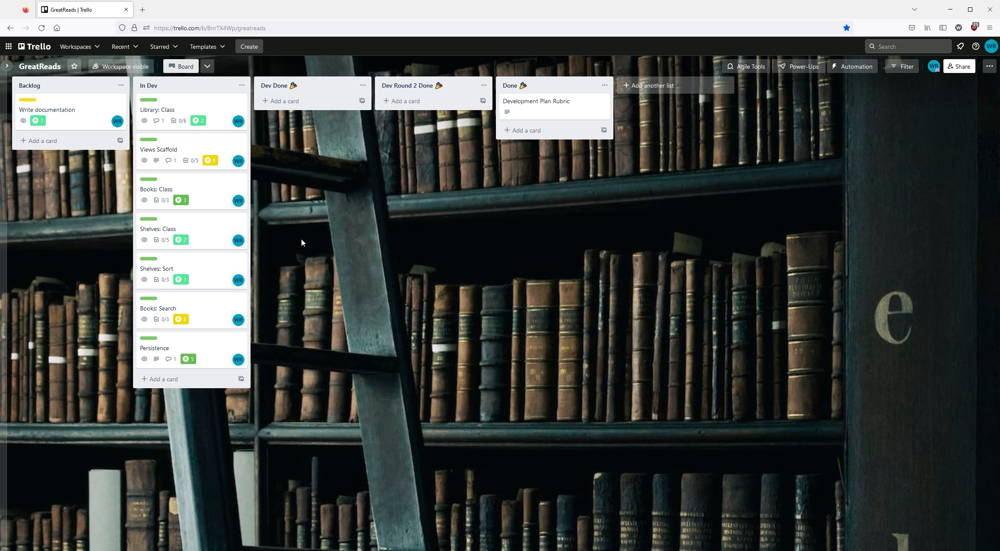

Initial setup of the trello board.

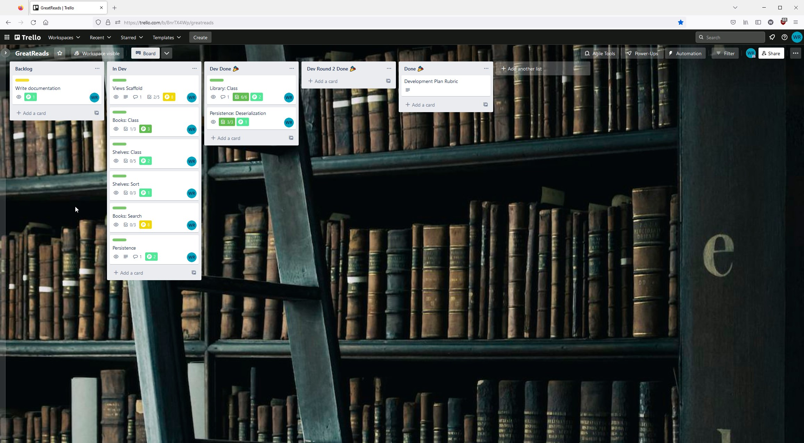

Overview after first dev sprint. Some tasks completed.

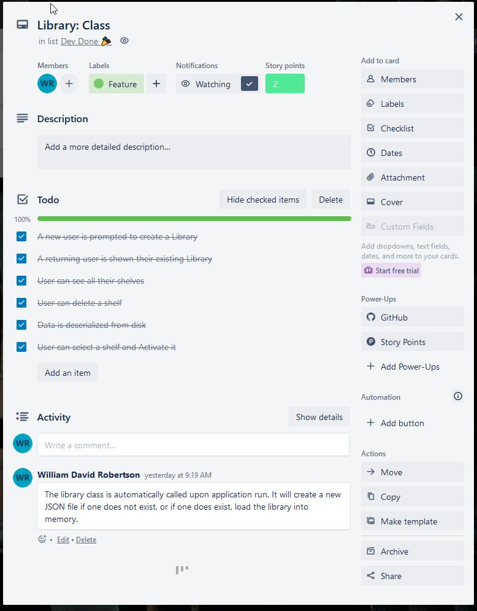

Card of Library features.

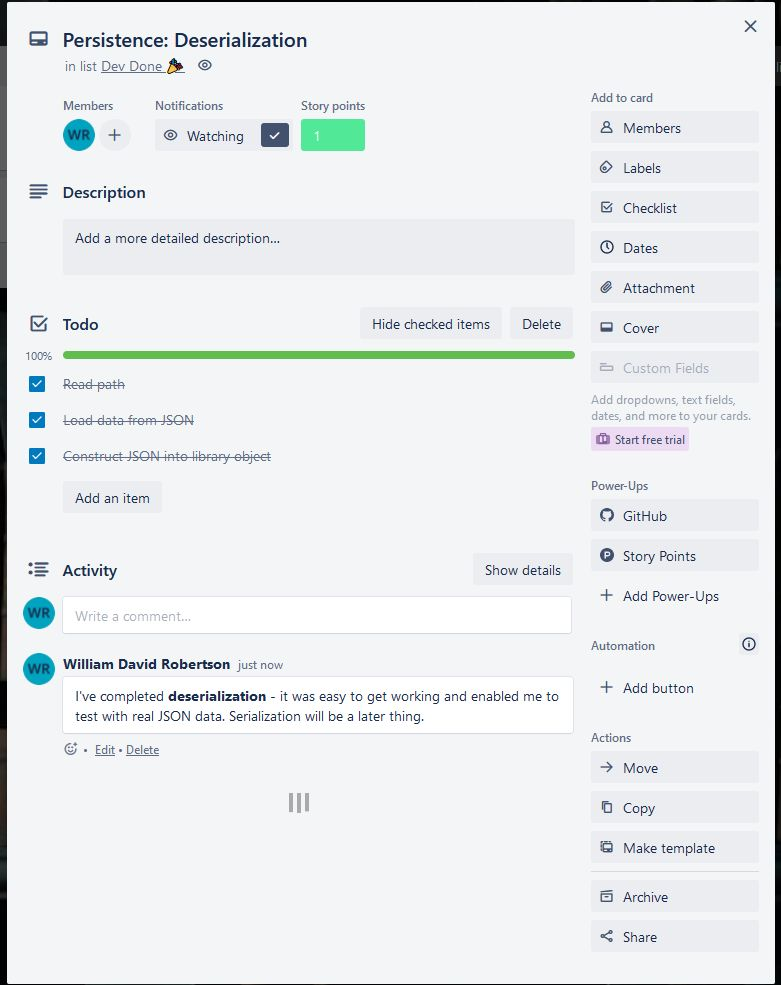

Card of Persistence features.

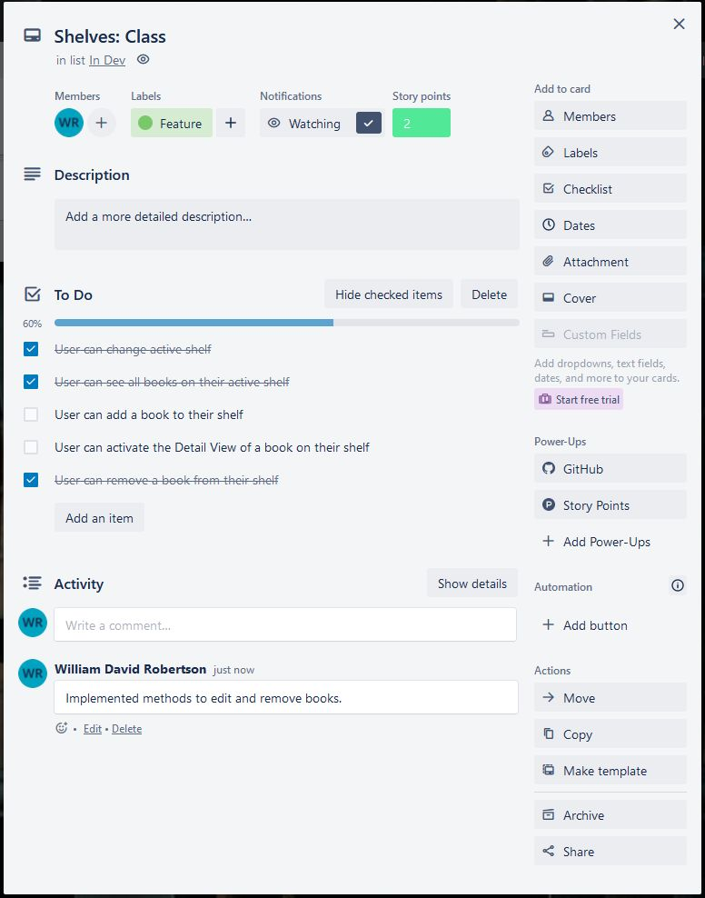

An in-progress task; building menus took longer than anticipated.

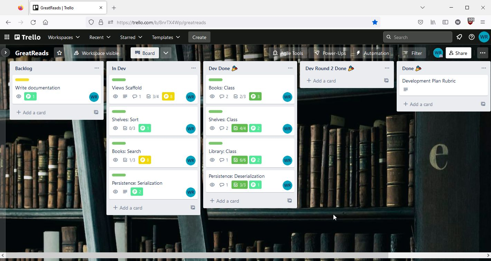

More progress after second sprint. Cards beginning to be ticked off, and updated with comments.

Some under-estimated story points, some over, so I had to also tweak those along the way.

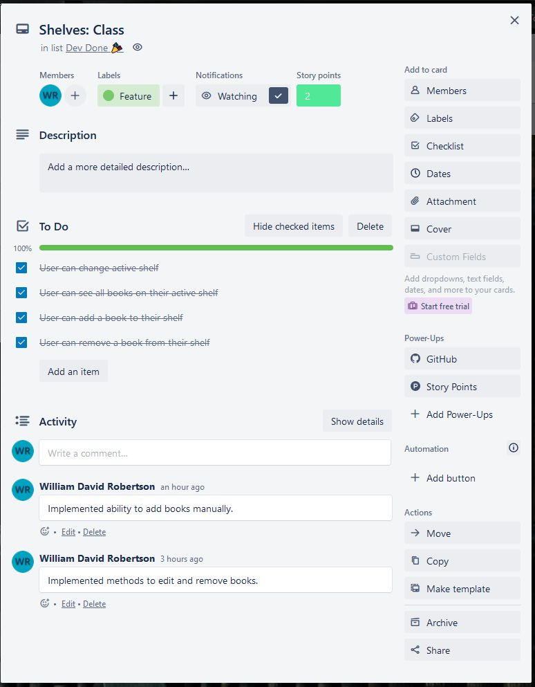

Shelf card is feature-complete.

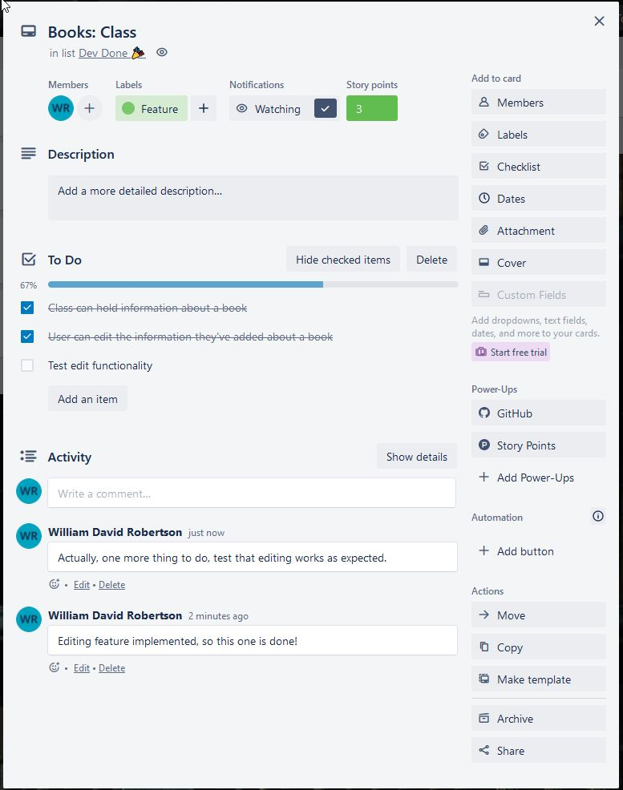

Books just need a unit test for editing functionality.

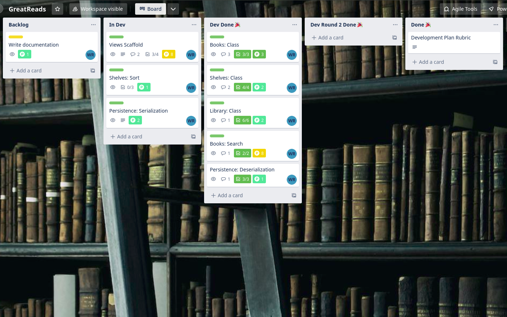

Search is complete, persistence and sorting are the final features to nail.

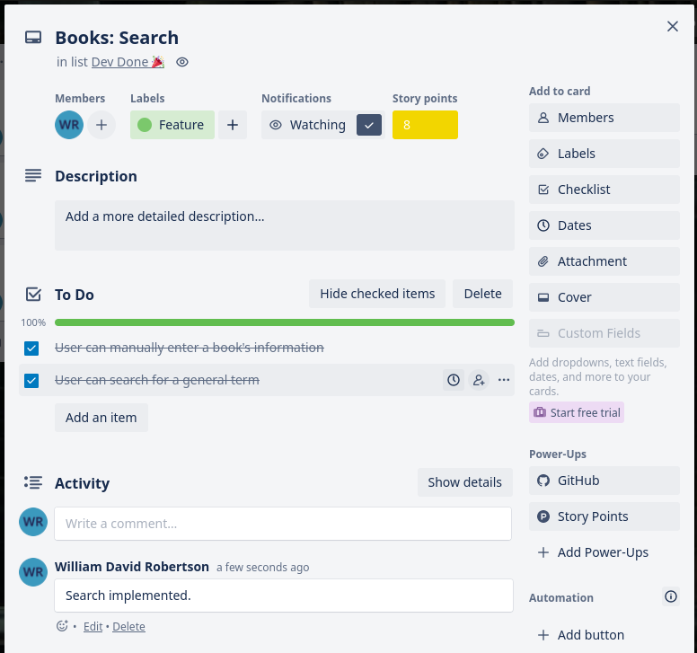

Search card. This was easier to get working than I thought... Hoping I haven't left any holes.

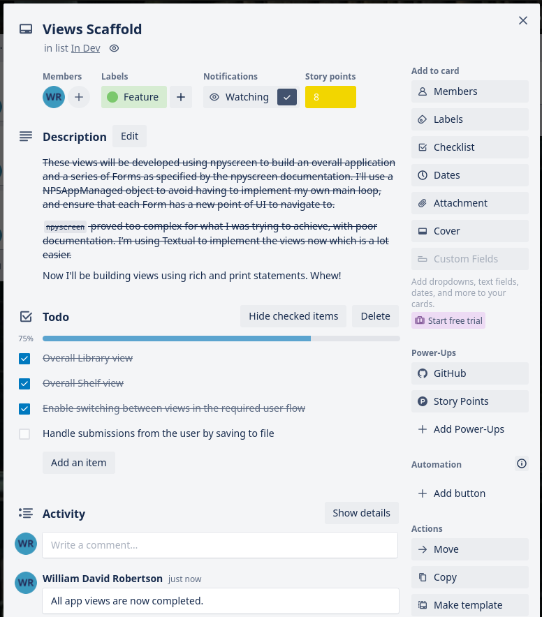

Views are nearly complete, except for the concept of saving to disk.

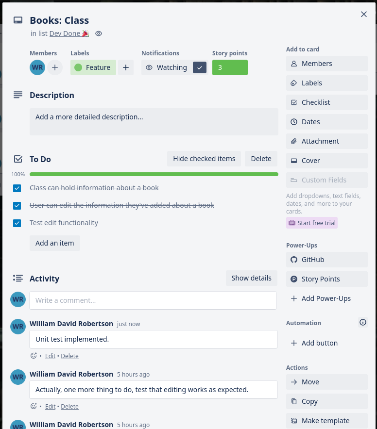

Books finished.

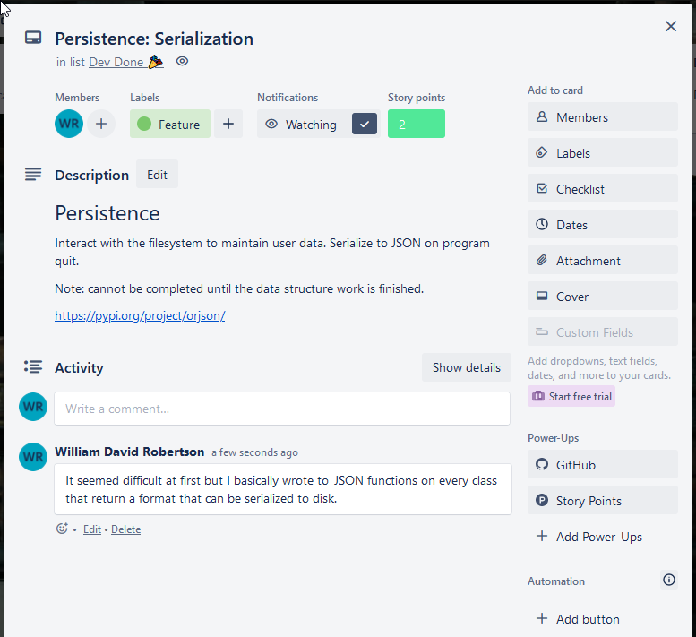

Feature complete! I want to add some testing to various elements before I call it a project lock.

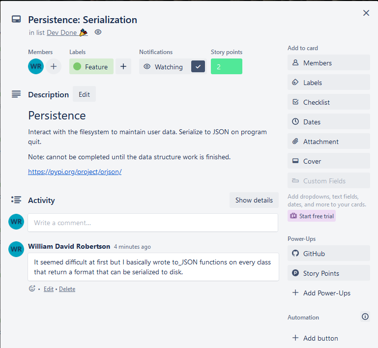

I ended up implementing deserialization way earlier than I thought I would to help with working with a real JSON file. However, I didn't get to serialization until near the end of the project.

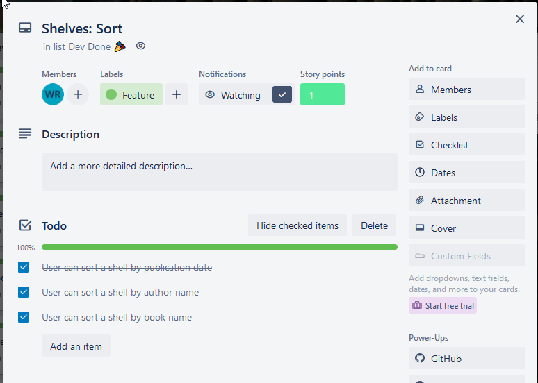

I was pleasantly surprised that my estimate for the time it would take me to implement sorting was right! Not long at all, it turns out.